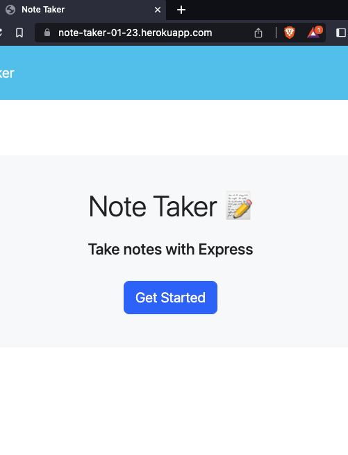
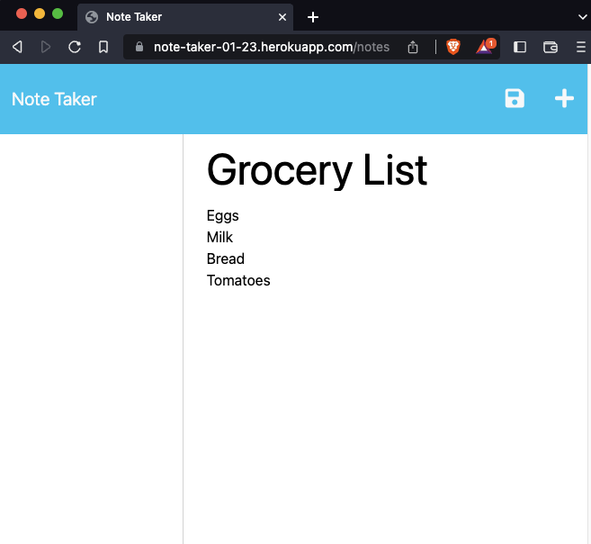

# Note Taker

## Description

The note taker app is an app that allows a user to type and save notes. It uses express.js for its backend. The notes are saved in the db.json file in real-time, and the notes should display as saved on the app's left-hand side. The floppy disk icon is the save button, and the plus icon is to add a new note.

## Visuals

## Deployed Link:

https://note-taker-01-23.herokuapp.com/
